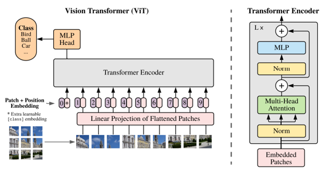
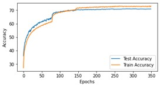
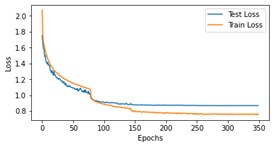
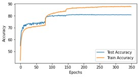
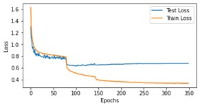

# Vision Transformer (ViT) 

- We trained ViT network using CIFAR-10 dataset for Image classification. 

- We adopted two approaches for training on the CIFAR-10. First, we trained the network by randomly assigning its weights. Second, we used transfer learning to finetune the trained network on ImageNet daatset.

Network:
------- 

<figure style="text-align:center; margin:0">
  
  <figcaption style="text-align:center; margin-top:0.5em;">
    Fig. 1. The schematic representation of the ViT network. The Image source is taken from
    <a href="https://arxiv.org/abs/2010.11929" target="_blank" rel="noopener noreferrer">
      AN IMAGE IS WORTH 16X16 WORDS: TRANSFORMERS FOR IMAGE RECOGNITION AT SCALE
    </a>.
  </figcaption>
</figure>

Results:
-----------------------------------------

We achieved test accuracy of 70.97% and 80.97% when using random initialization and transfer learning respectively.  

   
  Fig. 2. Plot for Training and Testing Accuracies when uisng Random Weight Initialization.

   
  Fig. 3. Plot for Training and Testing Losses when uisng Random Weight Initialization.

   
  Fig. 4. Plot for Training and Testing Accuracies when using Transfer Learning.

   
  Fig. 5. Plot for Training and Testing Losses when using Transfer Learning.

